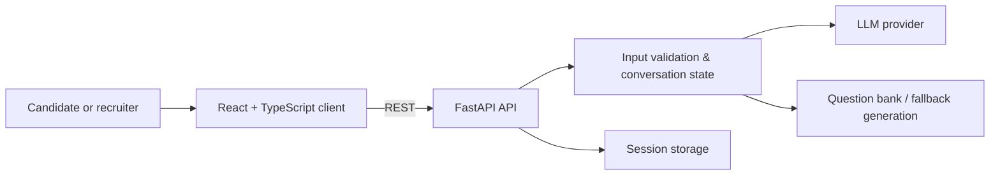

# TalentScout AI — conversational hiring assistant

A full-stack application that collects candidate context through chat and produces tailored technical questions. It is designed as a focused product prototype: a recruiter-friendly flow in React and a FastAPI service that validates candidate data and orchestrates LLM-backed question generation.

> **Status:** Active prototype. Do not use with real candidate data until authentication, data retention, consent records, and access controls are implemented.

## Why it matters

Candidate screening is often repetitive and inconsistent. TalentScout turns a structured intake—role, experience, stack, location, and preferences—into a consistent conversation and a targeted technical-question set.

## Architecture



## Features

- Conversational candidate intake with progress feedback
- Field-level validation for contact and professional information
- LLM-assisted, role-aware technical-question generation
- Deterministic fallback question bank
- Responsive React interface built with TypeScript and Tailwind

## Repository layout

```text
talentbot-ai/
├── backend/
│   ├── api.py              # FastAPI entrypoint and API contracts
│   ├── core/               # config, prompts, validation, LLM and storage
│   ├── tests/              # backend tests
│   └── requirements.txt
├── frontend/
│   ├── src/                # React application
│   └── package.json
├── DEPLOYMENT.md
└── netlify.toml
```

## Run locally

### Prerequisites

- Node.js 18+
- Python 3.10+

### Setup

```bash
git clone https://github.com/riteshdhobale/talentbot-ai.git
cd talentbot-ai

npm run install:all

# Configure secrets locally; never commit this file.
cp backend/env.example backend/.env
```

Add the required LLM provider settings to `backend/.env`, then start both services:

```bash
npm run dev
```

- Frontend: `http://localhost:5173`
- API: `http://localhost:8000`
- Interactive API docs: `http://localhost:8000/docs`

## Quality checks

```bash
# Frontend
cd frontend && npm run lint && npm run build

# Backend
cd ../backend && python -m pytest
```

GitHub Actions validates the frontend lint/build and Python syntax on pushes and pull requests.

## Privacy and responsible use

This product handles personally identifiable candidate information. Before a production deployment, add explicit consent capture, authenticated roles, encrypted persistence, deletion/export workflows, retention limits, audit logs, and a reviewed privacy policy.

## Next high-impact feature

Add a **structured evaluation workspace**: rubric-based scoring with evidence citations from the conversation, recruiter review/override, and bias checks. This would make TalentScout more than an intake chatbot—it would demonstrate responsible AI workflow design.

## License

Add a license before accepting external contributions.
