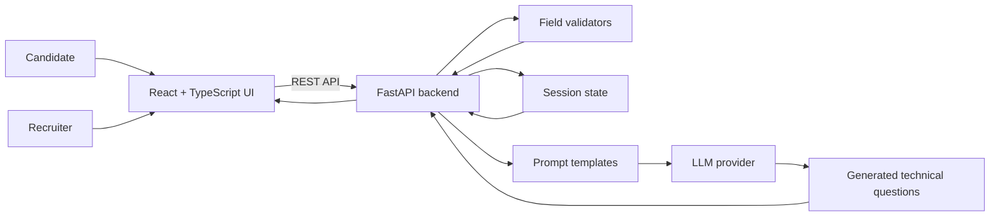

# TalentScout AI

Conversational hiring assistant that collects candidate context, validates key details, and generates role-specific technical questions through a full-stack AI workflow.

TalentScout is designed as a recruiter-friendly screening product: React handles the guided chat experience, FastAPI manages candidate sessions and validation, and the AI layer turns a candidate's role, experience, and tech stack into targeted technical questions.

## Why it matters

Early hiring screens are repetitive, inconsistent, and often poorly documented. TalentScout turns the process into a structured conversation with reusable candidate context and generated interview questions.

## Current capabilities

- Conversational candidate intake with progress feedback.
- Field-level validation for contact and professional information.
- LLM-assisted technical-question generation.
- Deterministic fallback question bank when AI generation is unavailable.
- React + TypeScript frontend with Tailwind and shadcn/ui.
- FastAPI backend with prompt, validation, storage, and LLM modules.
- GitHub Actions for frontend lint/build and backend syntax checks.

## Architecture



## Tech stack

| Layer | Tools |
| --- | --- |
| Frontend | React, TypeScript, Vite, Tailwind, shadcn/ui, React Query |
| Backend | Python, FastAPI, Pydantic |
| AI | LLM provider abstraction, prompt templates, question generation |
| Quality | GitHub Actions, frontend lint/build, backend compile check |

## Repository structure

```text
talentbot-ai/
├── backend/
│   ├── api.py              # FastAPI entrypoint and API contracts
│   ├── core/               # config, prompts, validation, LLM, storage
│   ├── tests/              # backend tests/checks
│   └── requirements.txt
├── frontend/
│   ├── src/                # React application
│   └── package.json
├── .github/workflows/ci.yml
├── API_DOCS.md
├── DEPLOYMENT.md
├── QUICK_START.md
└── netlify.toml
```

## Quick start

### Prerequisites

- Node.js 20+
- Python 3.11+
- npm
- Your own LLM provider key for live AI generation

### Install

```bash
git clone https://github.com/riteshdhobale/talentbot-ai.git
cd talentbot-ai
npm run install:all
```

### Configure

```bash
cp backend/env.example backend/.env
```

Add local settings and API keys to `backend/.env`. Do not commit real secrets.

### Run locally

```bash
npm run dev
```

Frontend: `http://localhost:5173`

API: `http://localhost:8000`

API docs: `http://localhost:8000/docs`

## Quality checks

```bash
cd frontend
npm run lint
npm run build
```

```bash
cd backend
python -m compileall -q .
```

GitHub Actions runs these checks on push and pull request.

## Privacy and responsible use

TalentScout handles candidate information, so a production version needs authentication, consent capture, encrypted persistence, deletion/export workflows, retention limits, audit logs, and clear access controls.

## High-impact next feature

Add a recruiter review dashboard:

- Candidate summary cards.
- Generated questions grouped by skill.
- Difficulty labels and expected answer hints.
- Recruiter review and override workflow.
- Export to PDF or email.
- Persistent session storage with admin-only access.

That would move TalentScout from a strong AI demo into a usable hiring workflow product.

## Roadmap

- [ ] Add persistent storage for candidate sessions.
- [ ] Add authentication and recruiter roles.
- [ ] Add frontend screenshots and a demo GIF.
- [ ] Add backend tests for validators and session flow.
- [ ] Add an evaluation set for generated question quality.
- [ ] Deploy frontend and backend with documented environment variables.

## Documentation

- [API Documentation](./API_DOCS.md)
- [Deployment Guide](./DEPLOYMENT.md)
- [Quick Start](./QUICK_START.md)

## License

Add a license before accepting external contributions.
